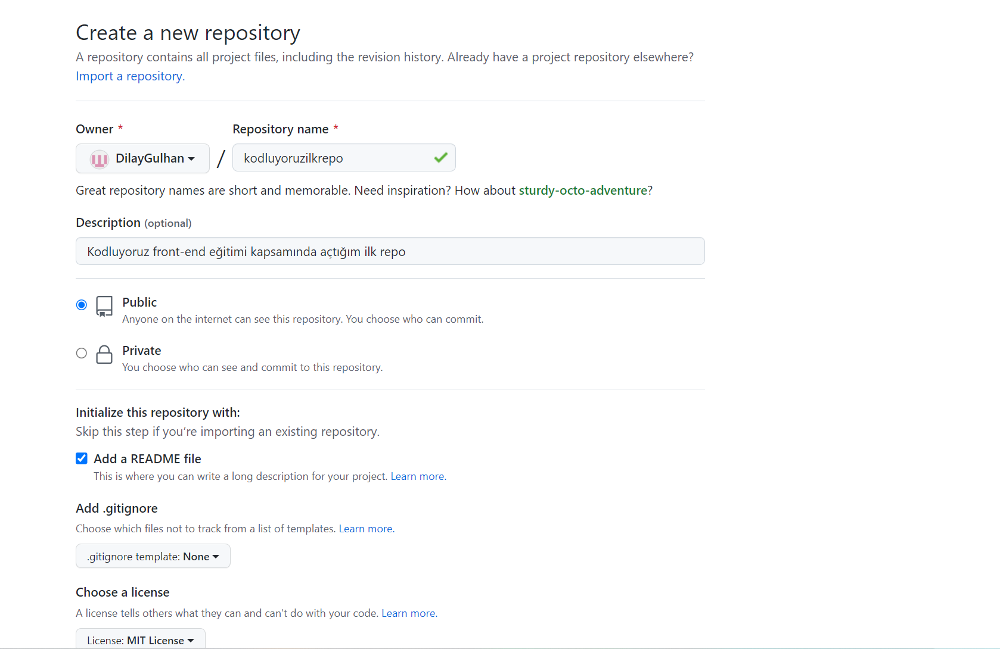

# KODLUYORUZ İLK REPO

Bu repo [Kodluyoruz](https://kodluyoruz.org/tr/kodluyoruz/) Front-End Eğitiminde oluşturduğumuz ilk repo. İçerisinde bir adet README dosyası, bir adet index.html barındırıyor.

##  Installation
Öncellikle projeyi clonelayın.

>  
> git https://github.com/DilayGulhan/kodluyoruzilkrepo.git 
>

## Usage

Projeyi cloneladıktan sonra Visual Studio Code programında açınız. 

Linux için : 

> cd kodluyoruzilkrepo
>code

## Contrubuting 
Pull requestler kabul edilir. Büyük değişiklikler için , lütfen önce neyi değiştirmek istediğnizi tartışmak için bir konu açınız.

## License 

[MIT](https://opensource.org/licenses/MIT)
